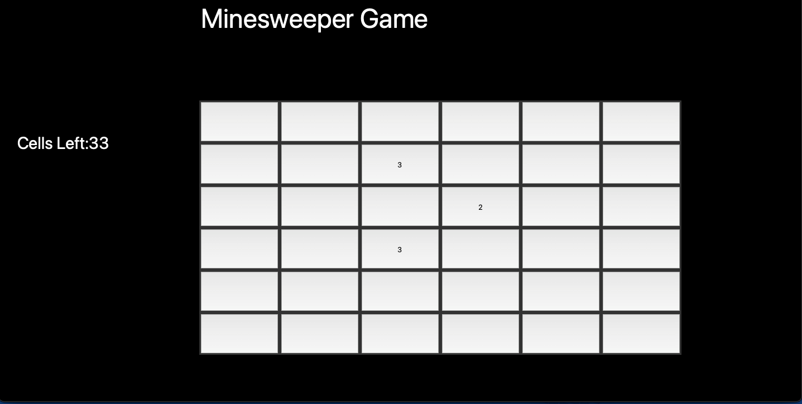

# Minesweeper Game

A classic Minesweeper game implemented using Python and Tkinter.

Features

Fully interactive Minesweeper grid.

Left-click to reveal cells, right-click to flag mines.

Win and lose conditions with appropriate messages.

Simple and intuitive GUI built using Tkinter.

Requirements

Ensure you have Python installed on your system. The game uses Tkinter, which comes pre-installed with Python.

How to Play

Left-click on a cell to reveal it.

Right-click to flag/unflag a potential mine.

The game ends when you either reveal all safe cells (win) or click on a mine (lose).

Screenshots
 

Future Improvements

Customizable grid size and difficulty settings.

Improved graphics and animations.

Leaderboard for best times.

Sound effects for better user experience.

License

This project is open-source and free to use. Feel free to contribute or modify it as needed.

Author

Oritse-tsegbemi Eyito

